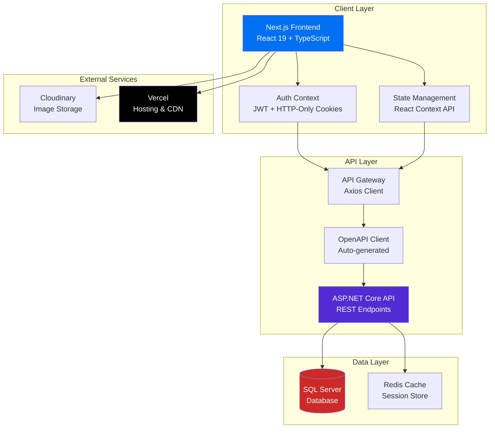
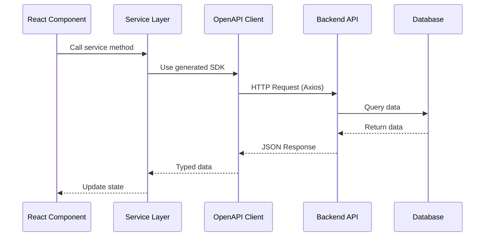
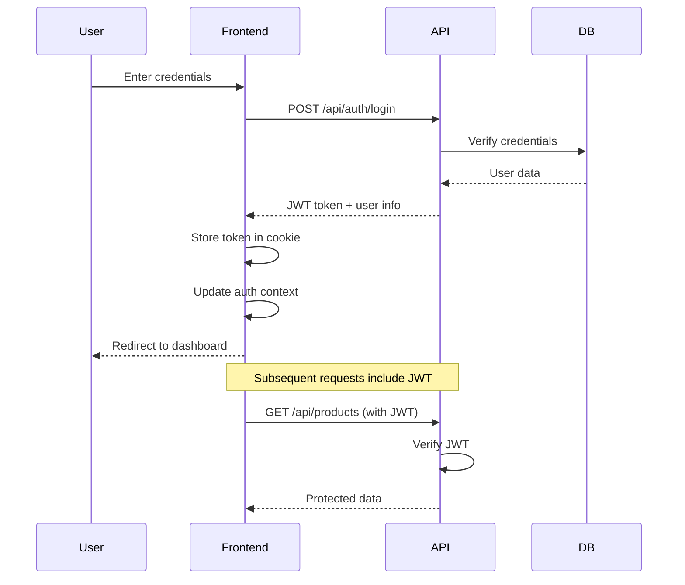

<div align="center">

# 🐾 VetFeed Management System

**Modern Inventory & Sales Management Platform for Veterinary Feed Businesses**

[](https://github.com/NguyenThanhTrung-N2T/VETFEED-MANAGEMENT-FE/actions/workflows/ci.yml)
[](https://nextjs.org/)
[](https://www.typescriptlang.org/)
[](https://vetfeed-management-fe.vercel.app)

[🚀 Live Demo](https://vetfeed-management-fe.vercel.app) • [📖 Documentation](#-table-of-contents) • [🐛 Report Bug](https://github.com/NguyenThanhTrung-N2T/VETFEED-MANAGEMENT-FE/issues) • [✨ Request Feature](https://github.com/NguyenThanhTrung-N2T/VETFEED-MANAGEMENT-FE/issues)

</div>

---

## 📑 Table of Contents

- [Introduction](#-introduction)
- [Key Features](#-key-features)
- [Architecture](#-architecture)
- [Getting Started](#-getting-started)
  - [Prerequisites](#prerequisites)
  - [Installation](#installation)
  - [Environment Configuration](#environment-configuration)
  - [Running the Application](#running-the-application)
- [Project Structure](#-project-structure)
- [API Integration](#-api-integration)
- [Development](#-development)
- [Deployment](#-deployment)
- [Contributing](#-contributing)
- [License](#-license)
- [Roadmap](#-roadmap)
- [Author](#-author)
- [Support](#-support)

---

## 🌟 Introduction

**VetFeed Management System** is a comprehensive, production-ready web application designed specifically for veterinary feed distribution businesses. Built with cutting-edge technologies and modern development practices, it provides a complete solution for managing inventory, sales, customer relationships, and business analytics.

### Why VetFeed?

In the veterinary feed industry, managing complex inventory with batch tracking, expiration dates, and multiple units of measurement can be challenging. VetFeed solves these problems by providing:

- **🎯 Industry-Specific**: Tailored workflows for veterinary medicine and animal feed distribution
- **⚡ Real-Time Operations**: Instant inventory updates, live sales tracking, and real-time analytics
- **🔒 Enterprise Security**: JWT authentication, role-based access control, and audit trails
- **📱 Responsive Design**: Beautiful, mobile-first UI that works seamlessly across all devices
- **🚀 Modern Stack**: Built with Next.js 16, React 19, and TypeScript for optimal performance
- **📊 Business Intelligence**: Comprehensive analytics and reporting for data-driven decisions

### Live Application

🌐 **Production URL**: [https://vetfeed-management-fe.vercel.app](https://vetfeed-management-fe.vercel.app)

> **Note**: The application is fully functional and connected to a live backend API. All features including inventory management, sales processing, and analytics are operational.

### Related Repositories

- **Backend API**: [VETFEED-MANAGEMENT](https://github.com/NguyenThanhTrung-N2T/VETFEED-MANAGEMENT) - ASP.NET Core REST API with SQL Server

---

## ✨ Key Features

### 📦 Inventory Management

- **Multi-Warehouse Support**: Manage stock across multiple locations with real-time synchronization
- **Batch Tracking**: Track products by batch number with expiration date monitoring
- **Unit Conversion**: Flexible unit of measurement system (e.g., 1 Box = 10 Bottles)
- **Low Stock Alerts**: Automated notifications when inventory falls below threshold
- **Stock Transfers**: Seamless movement of inventory between warehouses
- **Inventory Valuation**: Real-time calculation of stock value using FIFO/LIFO methods

### 💰 Sales & Point of Sale

- **Quick Sales Interface**: Fast, intuitive POS system for rapid transaction processing
- **Multi-Payment Methods**: Support for cash, credit, installment, and mixed payments
- **Invoice Generation**: Automatic invoice creation with customizable templates
- **Return Management**: Handle product returns with automatic inventory adjustment
- **Discount Management**: Apply discounts at product or invoice level
- **Sales History**: Complete transaction history with search and filter capabilities

### 👥 Customer & Supplier Management

- **Customer Profiles**: Comprehensive customer database with purchase history
- **Credit Management**: Track credit limits, outstanding balances, and payment terms
- **Supplier Integration**: Manage supplier relationships and purchase orders
- **Contact Management**: Centralized contact database with communication history
- **Customer Segmentation**: Group customers by type, region, or purchase behavior

### 📊 Analytics & Reporting

- **Sales Dashboard**: Real-time revenue metrics, trends, and performance indicators
- **Profit Analysis**: Detailed profit margins, cost tracking, and profitability reports
- **Inventory Reports**: Stock levels, turnover rates, aging analysis, and valuation
- **Customer Analytics**: Purchase patterns, top customers, and retention metrics
- **Export Capabilities**: Export all reports to CSV for further analysis
- **Visual Charts**: Interactive charts and graphs using Recharts

### 🔐 Security & Access Control

- **Role-Based Permissions**: Three-tier access control (Admin, Manager, Staff)
- **JWT Authentication**: Secure token-based authentication with refresh tokens
- **Protected Routes**: Middleware-based route protection
- **Audit Trails**: Complete logging of all system activities
- **Session Management**: Automatic session timeout and renewal

---

## 🏗️ Architecture

### System Overview



### Technology Stack

#### Frontend

| Technology        | Version | Purpose                              |
| ----------------- | ------- | ------------------------------------ |
| **Next.js**       | 16.1.6  | React framework with App Router      |
| **React**         | 19.2.3  | UI library                           |
| **TypeScript**    | 5.x     | Type safety and developer experience |
| **Tailwind CSS**  | 4.x     | Utility-first styling                |
| **Framer Motion** | 12.x    | Smooth animations                    |
| **Recharts**      | 3.x     | Data visualization                   |
| **Axios**         | 1.13.x  | HTTP client                          |
| **Lucide React**  | 0.562.x | Icon library                         |

#### Development Tools

| Tool                   | Purpose                               |
| ---------------------- | ------------------------------------- |
| **ESLint**             | Code quality and consistency          |
| **OpenAPI TypeScript** | Auto-generate API client from Swagger |
| **Turbopack**          | Fast development builds               |
| **GitHub Actions**     | CI/CD automation                      |

#### Backend Integration

- **API**: ASP.NET Core 8.0 REST API
- **Database**: SQL Server with Entity Framework Core
- **Authentication**: JWT with refresh token rotation
- **Documentation**: OpenAPI/Swagger specification

---

## 🚀 Getting Started

### Prerequisites

Before you begin, ensure you have the following installed on your system:

- **Node.js** 20.x or higher ([Download](https://nodejs.org/))
- **npm** 10.x or higher (comes with Node.js)
- **Git** ([Download](https://git-scm.com/))

Optional but recommended:

- **VS Code** with ESLint and Prettier extensions
- **Backend API** running locally or accessible via URL

### Installation

1. **Clone the repository**

```bash
git clone https://github.com/NguyenThanhTrung-N2T/VETFEED-MANAGEMENT-FE.git
cd VETFEED-MANAGEMENT-FE
```

2. **Install dependencies**

```bash
npm install
```

3. **Set up environment variables**

```bash
cp .env.example .env.local
```

Then edit `.env.local` with your configuration (see [Environment Configuration](#environment-configuration) below).

4. **Generate API client** (Optional)

If you have the backend API running locally:

```bash
npm run gen:api
```

### Environment Configuration

Create a `.env.local` file in the root directory with the following structure:

```env
# ============================================
# API Configuration
# ============================================
NEXT_PUBLIC_API_URL=http://localhost:5186

# For production deployment
# NEXT_PUBLIC_API_URL=https://your-backend-api.com

# For development with ngrok tunnel
# NEXT_PUBLIC_API_URL=https://your-ngrok-url.ngrok-free.dev

# ============================================
# Cloudinary Configuration (Image Uploads)
# ============================================
NEXT_PUBLIC_CLOUDINARY_CLOUD_NAME=your_cloud_name
NEXT_PUBLIC_CLOUDINARY_UPLOAD_PRESET=your_upload_preset

# ============================================
# Application Settings
# ============================================
NEXT_PUBLIC_APP_NAME=VetFeed Management
NEXT_PUBLIC_APP_VERSION=0.1.0
```

#### Environment Variables Reference

| Variable                               | Description              | Required | Default                 |
| -------------------------------------- | ------------------------ | -------- | ----------------------- |
| `NEXT_PUBLIC_API_URL`                  | Backend API base URL     | ✅ Yes   | `http://localhost:5186` |
| `NEXT_PUBLIC_CLOUDINARY_CLOUD_NAME`    | Cloudinary cloud name    | ❌ No    | -                       |
| `NEXT_PUBLIC_CLOUDINARY_UPLOAD_PRESET` | Cloudinary upload preset | ❌ No    | -                       |
| `NEXT_PUBLIC_APP_NAME`                 | Application display name | ❌ No    | `VetFeed Management`    |
| `NEXT_PUBLIC_APP_VERSION`              | Application version      | ❌ No    | `0.1.0`                 |

> **Important**: Variables prefixed with `NEXT_PUBLIC_` are exposed to the browser. Never store sensitive secrets in these variables.

### Running the Application

#### Development Mode

```bash
npm run dev
```

The application will be available at [http://localhost:3000](http://localhost:3000)

#### Production Build

```bash
# Build the application
npm run build

# Start the production server
npm start
```

#### Code Quality Checks

```bash
# Run ESLint
npm run lint

# Run TypeScript type checking
npx tsc --noEmit

# Run all checks (same as CI)
npm run lint && npx tsc --noEmit && npm run build
```

---

## 📁 Project Structure

```
VETFEED-MANAGEMENT-FE/
├── .github/
│   └── workflows/
│       └── ci.yml                 # GitHub Actions CI/CD pipeline
│
├── app/                           # Next.js App Router (v16)
│   ├── (auth)/                    # Authentication route group
│   │   ├── login/                 # Login page
│   │   ├── register/              # Registration page
│   │   └── forgot-password/       # Password recovery
│   │
│   ├── (protected)/               # Protected routes (require auth)
│   │   ├── dashboard/             # Main dashboard
│   │   ├── ban-hang/              # Sales/POS interface
│   │   ├── nhap-hang/             # Purchase orders
│   │   ├── ton-kho/               # Inventory overview
│   │   ├── bao-cao/               # Reports & analytics
│   │   ├── cong-no/               # Debt management
│   │   ├── chuyen-kho/            # Warehouse transfers
│   │   ├── tra-hang/              # Returns processing
│   │   └── danh-muc/              # Master data management
│   │       ├── khach-hang/        # Customer management
│   │       ├── nha-cung-cap/      # Supplier management
│   │       ├── san-pham/          # Product catalog
│   │       └── kho/               # Warehouse management
│   │
│   ├── doi-tac/                   # Public partner showcase
│   ├── san-pham/                  # Public product catalog
│   ├── layout.tsx                 # Root layout with providers
│   ├── page.tsx                   # Landing page
│   └── globals.css                # Global styles & Tailwind
│
├── components/                    # Reusable React components
│   ├── ui/                        # Base UI components
│   ├── khach-hang/                # Customer-specific components
│   ├── san-pham/                  # Product-specific components
│   ├── bao-cao/                   # Report components
│   ├── Navbar.tsx                 # Navigation bar
│   └── ...
│
├── services/                      # API service layer
│   ├── auth.service.ts            # Authentication services
│   ├── sales.service.ts           # Sales operations
│   ├── inventory.service.ts       # Inventory management
│   ├── partner.service.ts         # Partner/supplier services
│   ├── product.service.ts         # Product services
│   └── ...
│
├── client/                        # Auto-generated API client
│   ├── types.gen.ts               # TypeScript type definitions
│   ├── sdk.gen.ts                 # API SDK functions
│   └── client.gen.ts              # Axios client configuration
│
├── lib/                           # Utility libraries
│   ├── axios.ts                   # Configured Axios instance
│   ├── animation-variants.ts      # Framer Motion variants
│   └── utils.ts                   # Helper functions
│
├── providers/                     # React Context providers
│   └── auth-provider.tsx          # Authentication context
│
├── types/                         # Custom TypeScript types
├── utils/                         # Utility functions
├── public/                        # Static assets
├── middleware.ts                  # Next.js middleware (auth guard)
├── next.config.ts                 # Next.js configuration
├── tailwind.config.ts             # Tailwind CSS configuration
├── tsconfig.json                  # TypeScript configuration
├── eslint.config.mjs              # ESLint configuration
└── package.json                   # Dependencies and scripts
```

### Key Directories Explained

- **`app/`**: Next.js 16 App Router with route groups for clean organization
- **`components/`**: Modular, reusable React components organized by feature
- **`services/`**: API service layer providing typed methods for backend communication
- **`client/`**: Auto-generated TypeScript client from OpenAPI specification
- **`providers/`**: React Context providers for global state management
- **`middleware.ts`**: Route protection and authentication middleware

---

## 🔌 API Integration

### Architecture

The frontend communicates with the backend via a REST API using an auto-generated TypeScript client from the OpenAPI/Swagger specification.



### API Client Generation

The API client is automatically generated from the backend's OpenAPI specification:

```bash
npm run gen:api
```

This creates:

- **Type definitions** in `client/types.gen.ts`
- **API functions** in `client/sdk.gen.ts`
- **Client configuration** in `client/client.gen.ts`

### Authentication Flow



---

## 💻 Development

### Development Workflow

1. Create a feature branch
2. Make your changes following coding standards
3. Run quality checks (ESLint, TypeScript)
4. Test your changes locally
5. Commit with conventional commit messages
6. Push and create a Pull Request

### Coding Standards

#### TypeScript

- Use strict typing, avoid `any` when possible
- Define interfaces for all data structures
- Use type inference where appropriate
- Document complex types with JSDoc comments

#### React Components

- Use functional components with hooks
- Keep components small and focused
- Extract reusable logic into custom hooks
- Use TypeScript for props

#### Styling

- Use Tailwind CSS utility classes
- Follow mobile-first responsive design
- Use consistent spacing scale
- Extract repeated patterns into components

### Commit Message Convention

Follow [Conventional Commits](https://www.conventionalcommits.org/):

- `feat:` New feature
- `fix:` Bug fix
- `docs:` Documentation changes
- `style:` Code style changes
- `refactor:` Code refactoring
- `test:` Adding or updating tests
- `chore:` Maintenance tasks

---

## 🚀 Deployment

### Vercel Deployment (Recommended)

1. **Connect your repository to Vercel**
   - Go to [Vercel](https://vercel.com)
   - Import your GitHub repository
   - Vercel will auto-detect Next.js

2. **Configure environment variables**
   - Add required variables in Vercel dashboard
   - See [Environment Configuration](#environment-configuration)

3. **Deploy**
   - Vercel automatically deploys on every push to `main`

### Manual Deployment

For other platforms, build and start the production server:

```bash
npm run build
npm start
```

### CI/CD Pipeline

GitHub Actions automatically runs on every push:

- ✅ ESLint code quality check
- ✅ TypeScript type checking
- ✅ Production build verification

---

## 🤝 Contributing

We welcome contributions from the community!

### How to Contribute

1. Fork the repository
2. Clone your fork
3. Create a feature branch
4. Make your changes
5. Commit with conventional commit messages
6. Push to your fork
7. Create a Pull Request

### Pull Request Guidelines

- Provide a clear description of changes
- Reference related issues
- Ensure all CI checks pass
- Keep PRs focused on a single feature/fix
- Update documentation if needed

---

## 📄 License

This project is licensed under the **MIT License**.

```
MIT License

Copyright (c) 2026 Nguyễn Thành Trung

Permission is hereby granted, free of charge, to any person obtaining a copy
of this software and associated documentation files (the "Software"), to deal
in the Software without restriction, including without limitation the rights
to use, copy, modify, merge, publish, distribute, sublicense, and/or sell
copies of the Software, and to permit persons to whom the Software is
furnished to do so, subject to the following conditions:

The above copyright notice and this permission notice shall be included in all
copies or substantial portions of the Software.

THE SOFTWARE IS PROVIDED "AS IS", WITHOUT WARRANTY OF ANY KIND, EXPRESS OR
IMPLIED, INCLUDING BUT NOT LIMITED TO THE WARRANTIES OF MERCHANTABILITY,
FITNESS FOR A PARTICULAR PURPOSE AND NONINFRINGEMENT.
```

See the [LICENSE](LICENSE) file for details.

---

## 🗺️ Roadmap

### Version 0.2.0 (Q2 2026)

- [ ] **Progressive Web App**: Offline capabilities and installable app
- [ ] **Mobile Application**: React Native companion app
- [ ] **Advanced Analytics**: Predictive analytics and AI-powered insights
- [ ] **Multi-language Support**: i18n with Vietnamese and English
- [ ] **Dark Mode**: Complete dark theme implementation
- [ ] **Email Notifications**: Automated alerts and reports

### Version 0.3.0 (Q3 2026)

- [ ] **Barcode Scanner**: Mobile barcode scanning for inventory
- [ ] **Advanced Reporting**: Custom report builder with drag-and-drop
- [ ] **API Integrations**: Third-party accounting software integration
- [ ] **Bulk Operations**: Import/export data in multiple formats
- [ ] **Advanced Permissions**: Granular role-based access control
- [ ] **Webhook Support**: Real-time event notifications

### Version 1.0.0 (Q4 2026)

- [ ] **Multi-tenant Architecture**: Support for multiple businesses
- [ ] **Advanced Audit Logs**: Comprehensive activity tracking
- [ ] **Performance Optimization**: Further speed improvements
- [ ] **Complete Documentation**: API docs and user guides
- [ ] **Automated Testing**: Unit, integration, and E2E tests
- [ ] **Mobile Payment Integration**: Support for digital wallets

### Future Considerations

- 🤖 AI-powered demand forecasting
- 📦 Automated reordering system
- 🛒 E-commerce platform integration
- 📱 WhatsApp/SMS notifications
- 🌍 Multi-currency support
- 📊 Advanced inventory optimization algorithms

---

## 👨‍💻 Author

<div align="center">


### Nguyễn Thành Trung

**Software Engineering Student**

🎓 **University of Information Technology (UIT)**  
Vietnam National University - Ho Chi Minh City

📚 **Major**: Software Engineering  
🆔 **Student ID**: 23521683  
📧 **Email**: nguyentrung191225@gmail.com

[](https://github.com/NguyenThanhTrung-N2T)
[](mailto:nguyentrung191225@gmail.com)

---

### About This Project

This project was developed as part of my software engineering studies and serves multiple purposes:

- 📖 **Learning & Practice**: Hands-on experience with modern web technologies
- 💼 **Portfolio Building**: Showcase of full-stack development skills
- 🎯 **Internship Preparation**: Demonstration of real-world application development
- 🚀 **Career Development**: Building expertise in enterprise-level systems

**Technical Focus Areas:**

- Frontend development with Next.js and React
- TypeScript for type-safe development
- RESTful API integration and consumption
- State management and authentication
- Responsive UI/UX design
- CI/CD and deployment workflows

</div>

---

## 💬 Support

### Get Help

- **📚 Documentation**: Check the sections above
- **🐛 Bug Reports**: [GitHub Issues](https://github.com/NguyenThanhTrung-N2T/VETFEED-MANAGEMENT-FE/issues)
- **💡 Feature Requests**: [GitHub Issues](https://github.com/NguyenThanhTrung-N2T/VETFEED-MANAGEMENT-FE/issues)
- **💬 Discussions**: [GitHub Discussions](https://github.com/NguyenThanhTrung-N2T/VETFEED-MANAGEMENT-FE/discussions)

### Contact

For questions or collaboration opportunities, feel free to reach out:

- **Email**: nguyentrung191225@gmail.com
- **GitHub**: [@NguyenThanhTrung-N2T](https://github.com/NguyenThanhTrung-N2T)

---

## 🙏 Acknowledgments

This project is built with amazing open-source technologies:

- [Next.js](https://nextjs.org/) - The React Framework for Production
- [React](https://react.dev/) - A JavaScript library for building user interfaces
- [TypeScript](https://www.typescriptlang.org/) - JavaScript with syntax for types
- [Tailwind CSS](https://tailwindcss.com/) - A utility-first CSS framework
- [Framer Motion](https://www.framer.com/motion/) - Production-ready animation library
- [Recharts](https://recharts.org/) - Redefined chart library built with React
- [Lucide](https://lucide.dev/) - Beautiful & consistent icon toolkit
- [Vercel](https://vercel.com/) - Platform for frontend developers

Special thanks to:

- **University of Information Technology (UIT)** for providing excellent education
- **Open-source community** for the amazing tools and libraries
- **All contributors** who help improve this project

---

<div align="center">

**[⬆ Back to Top](#-vetfeed-management-system)**

Made with 💙 by [Nguyễn Thành Trung](https://github.com/NguyenThanhTrung-N2T)

⭐ Star this repo if you find it helpful!

</div>
