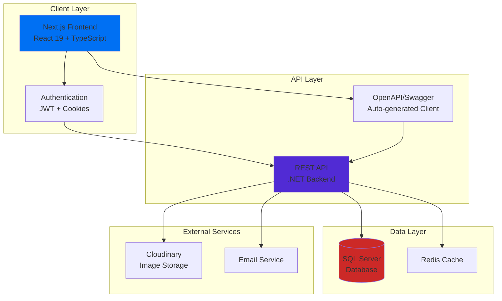

<div align="center">

# 🐾 VETFEED Management System

### Modern Inventory & Sales Management Platform for Veterinary Feed Businesses

[](https://github.com/NguyenThanhTrung-N2T/VETFEED-MANAGEMENT-FE/actions/workflows/ci.yml)
[](https://nextjs.org/)
[](https://www.typescriptlang.org/)
[](LICENSE)

[Live Demo](#-live-demo) • [Features](#-key-features) • [Quick Start](#-quick-start) • [Backend Repo](https://github.com/NguyenThanhTrung-N2T/VETFEED-MANAGEMENT)

</div>

---

## 🌐 Live Demo

> **Coming Soon!** Live demo will be available at: `https://vetfeed-management-fe.vercel.app`
>
> _Currently in development. Check back soon for the live preview!_

---

## 📖 Introduction

**VETFEED Management System** is a comprehensive web-based platform designed specifically for veterinary feed businesses. Built with modern technologies and best practices, it streamlines inventory management, sales operations, supplier relationships, and financial tracking.

This project was developed as a team effort and is continuously being enhanced with new features and improvements for portfolio building and real-world application.

### Why VETFEED?

- 🎯 **Purpose-Built**: Tailored for veterinary feed industry workflows
- 🚀 **Modern Stack**: Next.js 16, React 19, TypeScript for optimal performance
- 📊 **Real-time Analytics**: Interactive dashboards with Recharts
- 🔒 **Secure**: JWT authentication with role-based access control
- 📱 **Responsive**: Beautiful UI that works on all devices
- ⚡ **Fast**: Optimized with Turbopack and server-side rendering

### Related Repositories

- **Backend API**: [VETFEED-MANAGEMENT](https://github.com/NguyenThanhTrung-N2T/VETFEED-MANAGEMENT) - .NET Core REST API

---

## ✨ Key Features

### 📦 Inventory Management

- **Real-time Stock Tracking**: Monitor inventory levels across multiple warehouses
- **Batch Management**: Track products by batch with expiration dates
- **Low Stock Alerts**: Automated notifications for reordering
- **Warehouse Transfers**: Seamless stock movement between locations

### 💰 Sales & Invoicing

- **Point of Sale**: Quick and intuitive sales interface
- **Invoice Generation**: Automated invoice creation with customizable templates
- **Payment Tracking**: Multiple payment methods (Cash, Credit, Installment)
- **Return Management**: Handle product returns and refunds efficiently

### 👥 Customer & Supplier Management

- **Customer Profiles**: Comprehensive customer information and purchase history
- **Credit Management**: Track customer credit limits and outstanding balances
- **Supplier Integration**: Manage supplier relationships and purchase orders
- **Contact Management**: Centralized contact database

### 📊 Analytics & Reporting

- **Sales Analytics**: Revenue trends, top products, and performance metrics
- **Profit Analysis**: Detailed profit margins and cost tracking
- **Inventory Reports**: Stock levels, turnover rates, and valuation
- **Export Capabilities**: CSV export for all reports

### 🔐 Security & Access Control

- **Role-Based Permissions**: Admin, Manager, and Staff roles
- **Secure Authentication**: JWT-based authentication system
- **Audit Trails**: Track all system activities
- **Data Protection**: Encrypted sensitive information

---

## 🏗️ Overall Architecture



### Technology Stack

**Frontend:**

- **Framework**: Next.js 16.1.6 (App Router)
- **UI Library**: React 19.2.3
- **Language**: TypeScript 5
- **Styling**: Tailwind CSS 4
- **Animations**: Framer Motion
- **Charts**: Recharts
- **Icons**: Lucide React
- **HTTP Client**: Axios
- **State Management**: React Context API

**Development Tools:**

- **Code Quality**: ESLint 9
- **API Generation**: OpenAPI TypeScript
- **Build Tool**: Turbopack
- **CI/CD**: GitHub Actions

---

## 🚀 Quick Start

### Prerequisites

Before you begin, ensure you have the following installed:

- **Node.js** 20.x or higher ([Download](https://nodejs.org/))
- **npm** 10.x or higher (comes with Node.js)
- **Git** ([Download](https://git-scm.com/))

### Installation

1. **Clone the repository**

```bash
git clone https://github.com/NguyenThanhTrung-N2T/VETFEED-MANAGEMENT-FE.git
cd VETFEED-MANAGEMENT-FE
```

2. **Install dependencies**

```bash
npm install
```

3. **Set up environment variables**

```bash
# Copy the example environment file
cp .env.example .env.local

# Edit .env.local with your configuration
```

4. **Generate API client** (Optional - if backend is running)

```bash
npm run gen:api
```

5. **Start the development server**

```bash
npm run dev
```

6. **Open your browser**

Navigate to [http://localhost:3000](http://localhost:3000)

---

## ⚙️ Environment Configuration

Create a `.env.local` file in the root directory with the following variables:

```env
# API Configuration
NEXT_PUBLIC_API_URL=http://localhost:5186

# Cloudinary Configuration (Optional)
NEXT_PUBLIC_CLOUDINARY_CLOUD_NAME=your_cloud_name
NEXT_PUBLIC_CLOUDINARY_API_KEY=your_api_key

# Application Settings
NEXT_PUBLIC_APP_NAME=VETFEED Management
NEXT_PUBLIC_APP_VERSION=0.1.0
```

### Environment Variables Reference

| Variable                            | Description                             | Required | Default                 |
| ----------------------------------- | --------------------------------------- | -------- | ----------------------- |
| `NEXT_PUBLIC_API_URL`               | Backend API base URL                    | ✅ Yes   | `http://localhost:5186` |
| `NEXT_PUBLIC_CLOUDINARY_CLOUD_NAME` | Cloudinary cloud name for image uploads | ❌ No    | -                       |
| `NEXT_PUBLIC_CLOUDINARY_API_KEY`    | Cloudinary API key                      | ❌ No    | -                       |

> **Note**: Variables prefixed with `NEXT_PUBLIC_` are exposed to the browser.

---

## 🎮 Running the Project

### Development Mode

```bash
npm run dev
```

Starts the development server with hot-reload at [http://localhost:3000](http://localhost:3000)

### Production Build

```bash
# Build the application
npm run build

# Start the production server
npm start
```

### Code Quality Checks

```bash
# Run ESLint
npm run lint

# Run TypeScript type checking
npx tsc --noEmit

# Run all checks (same as CI)
npm run lint && npx tsc --noEmit && npm run build
```

### API Client Generation

```bash
# Generate TypeScript client from OpenAPI spec
npm run gen:api
```

> **Prerequisites**: Backend server must be running at `http://localhost:5186`

---

## 📁 Folder Structure

```
VETFEED-MANAGEMENT-FE/
├── .github/
│   └── workflows/
│       └── ci.yml                 # GitHub Actions CI workflow
├── app/                           # Next.js App Router
│   ├── (auth)/                    # Authentication routes
│   │   ├── login/
│   │   ├── register/
│   │   └── forgot-password/
│   ├── (protected)/               # Protected routes (require auth)
│   │   ├── dashboard/             # Dashboard page
│   │   ├── ban-hang/              # Sales page
│   │   ├── nhap-hang/             # Purchase page
│   │   ├── ton-kho/               # Inventory page
│   │   ├── bao-cao/               # Reports page
│   │   ├── cong-no/               # Debt management
│   │   ├── chuyen-kho/            # Warehouse transfer
│   │   ├── tra-hang/              # Returns page
│   │   └── danh-muc/              # Master data
│   │       ├── khach-hang/        # Customers
│   │       ├── nha-cung-cap/      # Suppliers
│   │       ├── san-pham/          # Products
│   │       └── kho/               # Warehouses
│   ├── layout.tsx                 # Root layout
│   ├── page.tsx                   # Landing page
│   └── globals.css                # Global styles
├── components/                    # Reusable React components
│   ├── ui/                        # UI components
│   ├── khach-hang/                # Customer components
│   ├── san-pham/                  # Product components
│   ├── bao-cao/                   # Report components
│   └── ...
├── services/                      # API service layer
│   ├── auth.service.ts
│   ├── sales.service.ts
│   ├── inventory.service.ts
│   └── ...
├── client/                        # Auto-generated API client
│   ├── types.gen.ts               # TypeScript types
│   └── client/                    # API client code
├── hooks/                         # Custom React hooks
│   └── useCountUp.ts
├── lib/                           # Utility libraries
│   ├── axios.ts                   # Axios instance
│   └── utils.ts                   # Helper functions
├── providers/                     # React Context providers
│   └── auth-provider.tsx          # Authentication provider
├── types/                         # TypeScript type definitions
├── utils/                         # Utility functions
│   └── csvHelper.ts               # CSV export utilities
├── public/                        # Static assets
├── middleware.ts                  # Next.js middleware (auth)
├── next.config.ts                 # Next.js configuration
├── tailwind.config.ts             # Tailwind CSS configuration
├── tsconfig.json                  # TypeScript configuration
├── eslint.config.mjs              # ESLint configuration
└── package.json                   # Project dependencies
```

### Key Directories

- **`app/`**: Next.js 16 App Router with route groups for authentication and protected routes
- **`components/`**: Modular, reusable React components organized by feature
- **`services/`**: API service layer with typed methods for backend communication
- **`client/`**: Auto-generated TypeScript client from OpenAPI specification
- **`providers/`**: React Context providers for global state management
- **`middleware.ts`**: Route protection and authentication middleware

---

## 🤝 Contributing

We welcome contributions from the community! Here's how you can help:

### Development Workflow

1. **Fork the repository**

Click the "Fork" button at the top right of this page.

2. **Clone your fork**

```bash
git clone https://github.com/YOUR_USERNAME/VETFEED-MANAGEMENT-FE.git
cd VETFEED-MANAGEMENT-FE
```

3. **Create a feature branch**

```bash
git checkout -b feature/amazing-feature
```

4. **Make your changes**

Follow our coding standards and best practices.

5. **Commit your changes**

```bash
git add .
git commit -m "feat: add amazing feature"
```

**Commit Message Convention:**

- `feat:` New feature
- `fix:` Bug fix
- `docs:` Documentation changes
- `style:` Code style changes (formatting, etc.)
- `refactor:` Code refactoring
- `test:` Adding or updating tests
- `chore:` Maintenance tasks

6. **Push to your fork**

```bash
git push origin feature/amazing-feature
```

7. **Create a Pull Request**

Go to the original repository and click "New Pull Request"

### Code Standards

- **TypeScript**: Use strict typing, avoid `any`
- **ESLint**: Code must pass linting (`npm run lint`)
- **Formatting**: Use consistent code formatting
- **Components**: Keep components small and focused
- **Testing**: Add tests for new features (when applicable)

### Pull Request Guidelines

- Provide a clear description of the changes
- Reference related issues (e.g., "Fixes #123")
- Ensure CI checks pass
- Request review from maintainers
- Keep PRs focused on a single feature/fix

---

## 📄 License

This project is licensed under the **MIT License** - see the [LICENSE](LICENSE) file for details.

```
MIT License

Copyright (c) 2026 Nguyễn Thành Trung

Permission is hereby granted, free of charge, to any person obtaining a copy
of this software and associated documentation files (the "Software"), to deal
in the Software without restriction, including without limitation the rights
to use, copy, modify, merge, publish, distribute, sublicense, and/or sell
copies of the Software, and to permit persons to whom the Software is
furnished to do so, subject to the following conditions:

The above copyright notice and this permission notice shall be included in all
copies or substantial portions of the Software.

THE SOFTWARE IS PROVIDED "AS IS", WITHOUT WARRANTY OF ANY KIND, EXPRESS OR
IMPLIED, INCLUDING BUT NOT LIMITED TO THE WARRANTIES OF MERCHANTABILITY,
FITNESS FOR A PARTICULAR PURPOSE AND NONINFRINGEMENT.
```

---

## 🗺️ Roadmap

### Version 0.2.0 (Q2 2026)

- [ ] **Mobile App**: React Native mobile application
- [ ] **Offline Mode**: PWA with offline capabilities
- [ ] **Advanced Analytics**: Predictive analytics and forecasting
- [ ] **Multi-language**: i18n support (English, Vietnamese)
- [ ] **Dark Mode**: Complete dark theme implementation

### Version 0.3.0 (Q3 2026)

- [ ] **API Integration**: Third-party accounting software integration
- [ ] **Barcode Scanner**: Mobile barcode scanning for inventory
- [ ] **Email Notifications**: Automated email alerts and reports
- [ ] **Advanced Reporting**: Custom report builder
- [ ] **Data Export**: Multiple export formats (PDF, Excel, CSV)

### Version 1.0.0 (Q4 2026)

- [ ] **Multi-tenant**: Support for multiple businesses
- [ ] **Advanced Permissions**: Granular role-based access control
- [ ] **Audit Logs**: Comprehensive activity tracking
- [ ] **Performance Optimization**: Further speed improvements
- [ ] **Documentation**: Complete API and user documentation

### Future Considerations

- AI-powered demand forecasting
- Automated reordering system
- Integration with e-commerce platforms
- Mobile payment integration
- Advanced inventory optimization

---

## 📞 Support & Contact

### Get Help

- **Issues**: [GitHub Issues](https://github.com/NguyenThanhTrung-N2T/VETFEED-MANAGEMENT-FE/issues)
- **Discussions**: [GitHub Discussions](https://github.com/NguyenThanhTrung-N2T/VETFEED-MANAGEMENT-FE/discussions)

### Connect with the Developer

- **GitHub**: [@NguyenThanhTrung-N2T](https://github.com/NguyenThanhTrung-N2T)
- **Email**: nguyentrung191225@gmail.com

---

## �‍💻 Author

<div align="center">

### Nguyễn Thành Trung

**Software Engineering Student**

🎓 **University of Information Technology (UIT)**  
Vietnam National University - Ho Chi Minh City

📚 **Major**: Software Engineering  
🆔 **Student ID**: 23521683

[](https://github.com/NguyenThanhTrung-N2T)
[](mailto:nguyentrung191225@gmail.com)

**Purpose**: Backend development practice, internship preparation, and portfolio building

</div>

---

## �🙏 Acknowledgments

Built with ❤️ using:

- [Next.js](https://nextjs.org/) - The React Framework for Production
- [React](https://react.dev/) - A JavaScript library for building user interfaces
- [TypeScript](https://www.typescriptlang.org/) - JavaScript with syntax for types
- [Tailwind CSS](https://tailwindcss.com/) - A utility-first CSS framework
- [Framer Motion](https://www.framer.com/motion/) - Production-ready animation library
- [Recharts](https://recharts.org/) - Redefined chart library built with React
- [Lucide](https://lucide.dev/) - Beautiful & consistent icon toolkit

---

<div align="center">

**[⬆ Back to Top](#-vetfeed-management-system)**

Made with 💙 by [Nguyễn Thành Trung](https://github.com/NguyenThanhTrung-N2T)

</div>
